# Autowerkstatt 4.0 Projekt - Bobbycar Exponat

## Einleitung

In diesem Projekt wurde ein Bobbycar umgebaut, um es als Exponat für die Hannovermessen im April 2024 zu präsentieren. Das umgebaute Bobbycar verfügt über ein Red Pitaya als Signalgenerator, einen Raspberry Pi, ein Touchdisplay und ein Lichtsystem, sowie weiter Komponeten(s. Abb. 1).

Abbildung 1: Bobbycar Exponat

## Komponenten

- Redpitaya
- Raspberry Pi 4
- Touchdisplay
- Lichtsystem
- Schalter
- Lüffter

## Systemanforderungen

- Raspberry Pi 4 mit Ubuntu 22.04 Desktop Betriebssystem

## Installation

1. Verbinden Sie den Redpitaya-Generator mit dem Raspberry Pi 4. (s. Abb. 2 und Abb. 3)

Abbildung 2: LAN-Verbindung Redpitaya-Generator

Abbildung 3: LAN-Verbindung Raspberry Pi 4

2. Installieren Sie das Ubuntu 22.04 Desktop Betriebssystem auf dem Raspberry Pi 4.
3. Schließen Sie das Licht, die Ventilatoren und das Touchdisplay an den Raspberry Pi 4 an.
4. Installieren Sie die erforderliche Software für das Touchdisplay von [diesem Link](https://github.com/lcdwiki/LCD-show).
5. Konfigurieren Sie die LAN- oder drahtlose Schnittstelle für die Fernsteuerung des Red Pitaya-Systems.

## Bedienungsanleitung

**Vor dem Start**

Vor dem Start des Systems müssen der Raspberry Pi und der Red Pitaya Generator an den Strom angeschlossen werden. Überprüfen Sie außerdem alle sonstigen Anschlüsse gemäß den Abbildungen 2-5.

Abbildung 4: Stromversogung Raspberry Pi und der Red Pitaya Generator
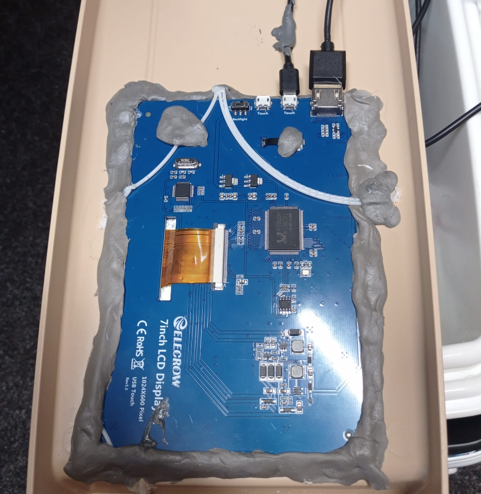
Abbildung 5: Anschluß Touchdisplay an den Raspberry Pi 4 (Beachten! Touchdisplay hat ggf. eine on/off switch)
**Screen Keyboard**

Der Raspberry Pi startet automatisch hoch. Die Steuerung des Displays kann entweder mit einer externen Tastatur oder einem Screen Keyboard erfolgen. Die Einstellungen hierfür finden Sie unter "Settings" oder gemäß Abbildung 6.
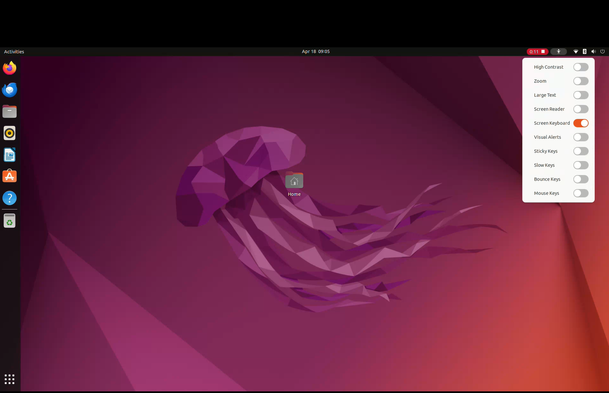
Abbildung 6: Screen Keyboard
**Prüfen der LAN-Verbindung mit dem Generator**

Stellen Sie sicher, dass eine Verbindung zum Generator über LAN besteht. Verwenden Sie die Abbildungen 7 und 8 als Referenz. 
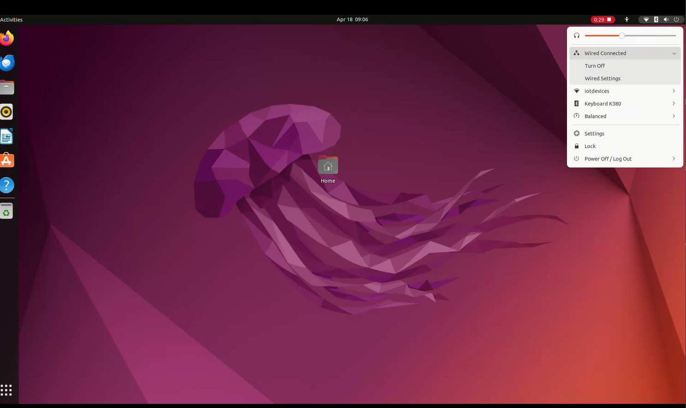
Abbildung 7: Verbindung zum Generator über LAN
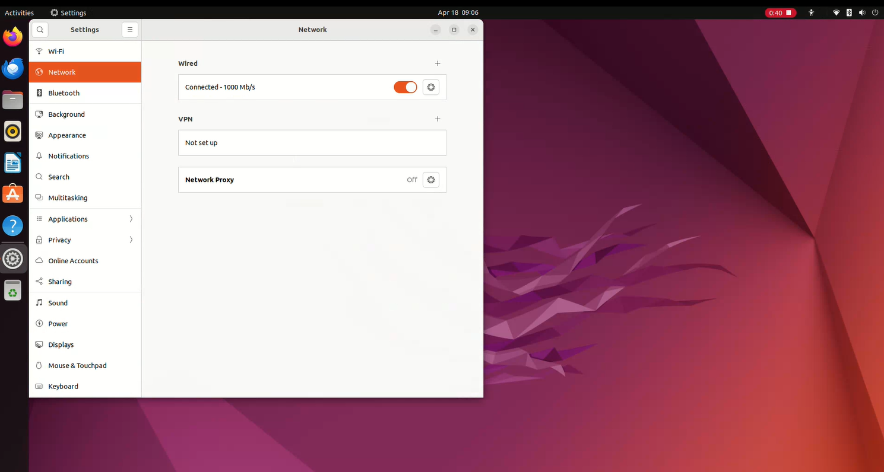
Abbildung 8: Verbindung zum Generator über LAN in Settings 
Sollte die Verbindung nicht aufgebaut werden können, folgen Sie bitte diesen Schritten:
- Überprüfen Sie die LAN-Verbindung zwischen den Geräten (siehe Abbildung 7 und Abbildungen 2-3).
- Gehen Sie zu den Einstellungen "Settings" und wählen Sie "Network".
- Wählen Sie bei "Wired" eine neue Verbindung aus (siehe Abbildung 9).
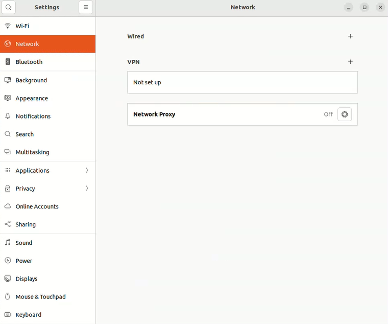
Abbildung 9: Neue Verbindung zum Generator über LAN in Settings
- Wählen Sie bei "IP4" die Option "Manual" und geben Sie unter "Addresses" die IP-Adresse "169.254.20.29" ein (siehe Abbildung 9-10) und auf Aply bestätigen.
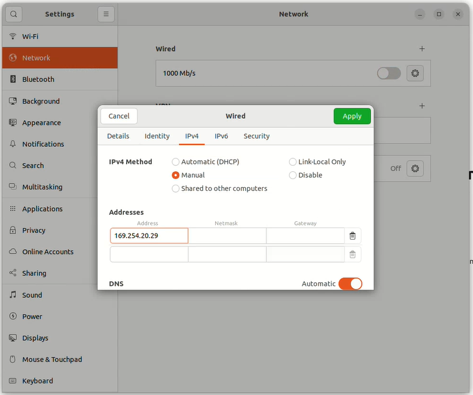
Abbildung 10: IP4-Settings
**Browser aufrufen**

Öffnen Sie einen Webbrowser und geben Sie die folgende Adresse ein:
[pr-ffff40.local/scpi_manager/#](http://rp-ffff40.local/scpi_manager/#) (siehe Abbildung 11f.).
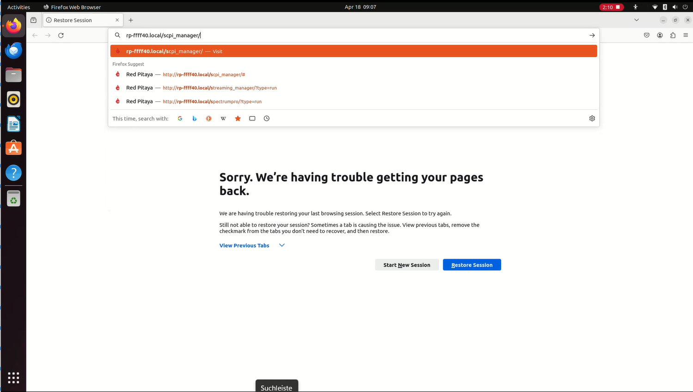
Abbildung 11: Webbrowser
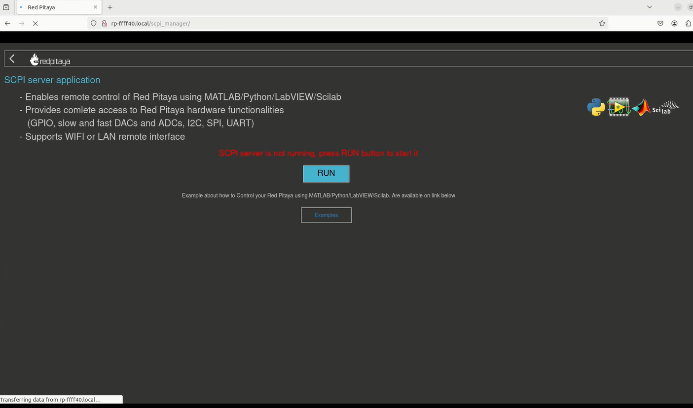
Abbildung 12: SCPI im Webbrowser
**Starten des SCPI-Servers**

Starten Sie den SCPI-Server, indem Sie die Schaltfläche "RUN" auswählen. Notieren Sie sich die IP-Adresse des Red Pitaya-Boards (in diesem Fall "169.254.6.100", siehe Abbildung 13).
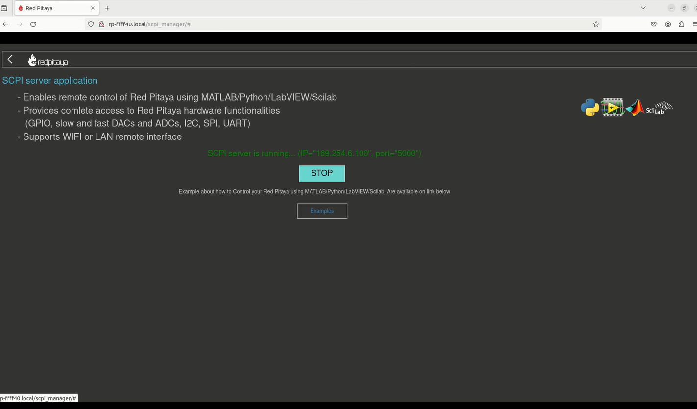
Abbildung 13: SCPI im Webbrowser gestartet
**Ändern der IP-Adresse des Red Pitaya-Boards im Python-Skript**

Öffnen Sie das Skript `makeSig.py` im Terminal (Terminal öffnen über Menüfeld -> Terminal) oder mit einem Editor (z. B. `nvim`) und ändern Sie die IP-Adresse entsprechend (siehe Abbildung 14 ff.).

```nvim ~/repos/autopulse-analytics-linas-ai-powered-clustering-for-cars/GUI/makeSig.py```
Ändern Sie die IP-Adresse des Red Pitaya-Boards entsprechend.
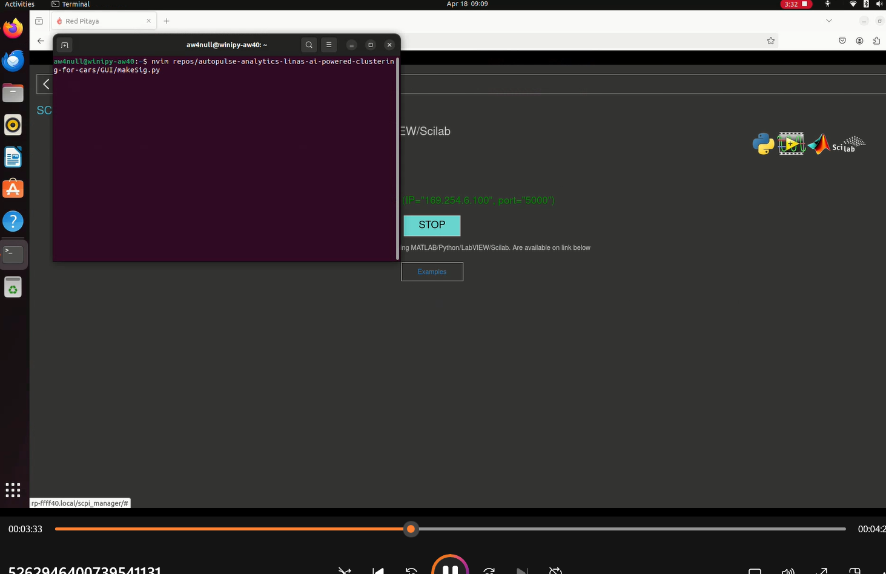
Abbildung 14: Terminal öffnen
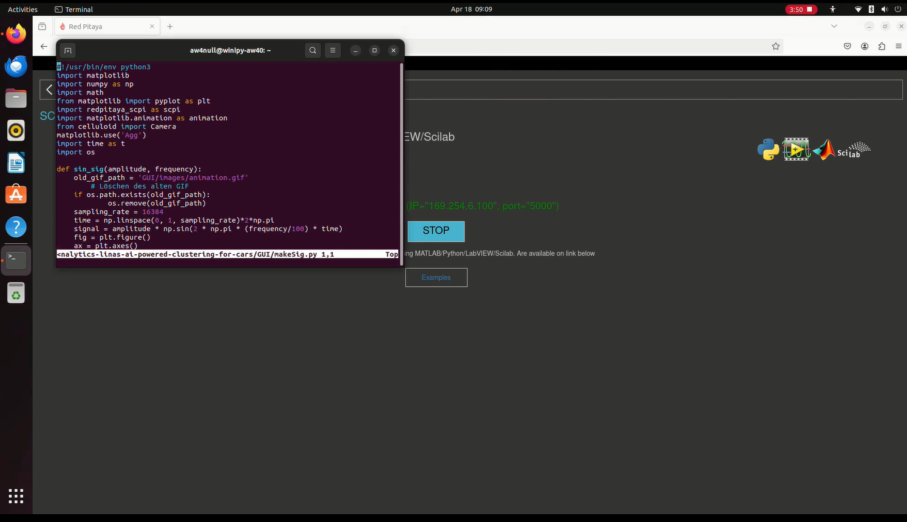
Abbildung 15: Skript `makeSig.py` in einem Editor
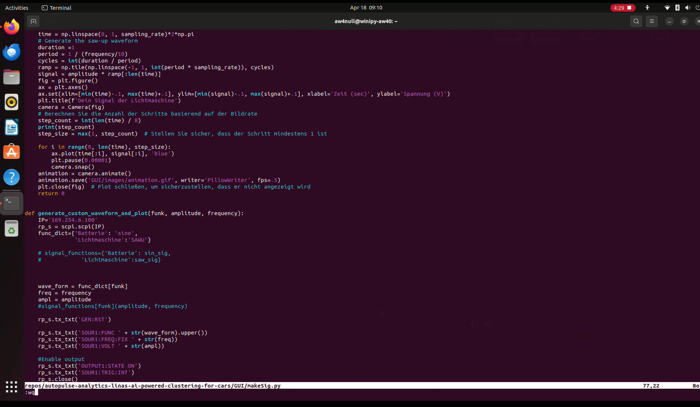
Abbildung 16: IP-Adresse des Red Pitaya-Boards (in diesem Fall "169.254.6.100") in makeSig.py
## 5. Aktivieren der Python Virtual Environment

Aktivieren Sie die Python Virtual Environment mit dem folgenden Befehl im Terminal:
```source ~/repos/autopulse-analytics-linas-ai-powered-clustering-for-cars/venv/bin/activate```

## 6. Wechseln zum Verzeichnis

Navigieren Sie zum Verzeichnis `autopulse-analytics-linas-ai-powered-clustering-for-cars` mit dem folgenden Befehl:
```cd ~/repos/autopulse-analytics-linas-ai-powered-clustering-for-cars/```

## 7. Ausführen der Hauptdatei

Führen Sie die Datei `main.py` aus:
```python3 ~/repos/autopulse-analytics-linas-ai-powered-clustering-for-cars/GUI/main.py```
oder 
```python3 GUI/main.py```

## Anpassungen

Um das Benutzererlebnis zu verbessern, wurde ein Pythonskript mit Kivy erstellt, um eine grafische Benutzeroberfläche zu erstellen und das Coderate-Design zu integrieren. Das Pythonskript verwendet eine Reihe von SCPI-Befehlen, um bestimmte Signale zu erzeugen.

## Lizenz

Dieses Projekt wird unter der [MIT-Lizenz](https://opensource.org/licenses/MIT) veröffentlicht.

## Kontakt

Bei Fragen oder Anregungen können Sie uns unter [Kontaktadresse] erreichen.
