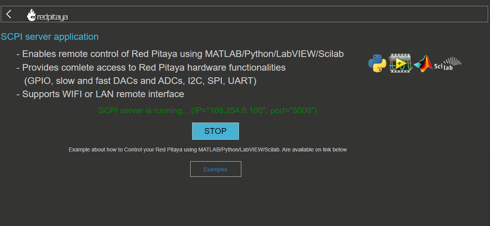

# Anleitung für die Signlagenerator-Soft-/Hardware

1. **Prüfen der LAN-Verbindung mit dem Generator**

   Überprüfen Sie, ob eine Verbindung zum Generator über LAN besteht. Verwenden Sie die folgenden Bilder als Referenz:

   
   

2. **Browser aufrufen**

   Öffnen Sie einen Webbrowser und geben Sie die folgende Adresse ein:

   [pr-ffff40.local/scpi_manager/](http://rp-ffff40.local/scpi_manager/)

3. **Starten des SCPI-Servers**

   Starten Sie den SCPI-Server, indem Sie die Schaltfläche "RUN" auswählen. Notieren Sie sich die IP-Adresse des Red Pitaya-Boards (in diesem Fall 169.254.6.100) (s. Bild 3).

   

4. **Ändern der IP-Adresse des Red Pitaya-Boards im Python-Skript**

   Öffnen Sie das Skript `makeSig.py` mit einem Editor (z. B. `nvim`) und ändern Sie die IP-Adresse entsprechend:

   ```bash
   nvim ~/repos/autopulse-analytics-linas-ai-powered-clustering-for-cars/Code/KIVYG/makeSig.py
   Ändern Sie die IP-Adresse des Red Pitaya-Boards entsprechend.


## 5. Aktivieren der Python Virtual Environment

Aktivieren Sie die Python Virtual Environment mit dem folgenden Befehl:
``source ~/repos/autopulse-analytics-linas-ai-powered-clustering-for-cars/venv/bin/activat``

## 6. Wechseln zum Code-Verzeichnis

Navigieren Sie zum Verzeichnis `Code` mit dem folgenden Befehl:

```cd ~/repos/autopulse-analytics-linas-ai-powered-clustering-for-cars/Code```

## 7. Ausführen der Hauptdatei
Führen Sie die Datei `main.py` aus:
```python KIVYG/main.py```
