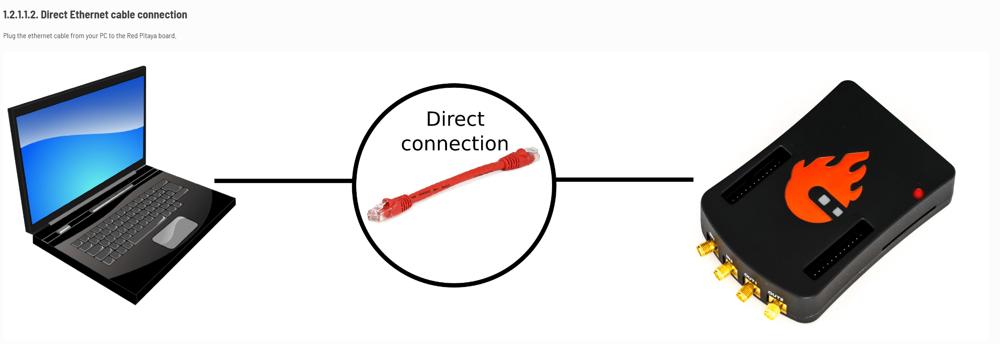

#Lambdasonde
##Fehler
 `P0171` - Gemischregelung - System zu mager
 `P0172` - Gemischregelung - System zu fett

• falsche Lambdasonde montiert
• Kraftstoff-Trimmung wurde nach dem Austausch des Sensors nicht zurückgesetzt (bei relevanten Fahrzeugen)
• Verschmutzungen durch Öl, Silikon, bleihaltigem Kraftstoff, Additive usw. beschädigen den neuen Sensor 
• Undichtheiten Allgemein, zum Beispiel in den folgenden Teilen: Einlasskrümmer, Vakuumschlauch, Turboschlauch, AGR-Ventil 
• Einspritzsystem – einschließlich Pumpe, Kraftstofffilter, Druckregler oder Einspritzdüsen. Prüfen Sie den Kraftstoffdruck, den Kraftstofffilter, den Druckregler auf Leck und die Einspritzdüsen auf Verschmutzungen
• Andere defekte Sensoren – als Auslöser der Fehlercodes. Zum Beispiel Luftmengenmesser, Kühlwassertemperatursensor, AGR-Ventil, Kurbelwelle oder Nockenwellenpositionssensor

#Ansauglufttemperatur
##Fehler
 `P0113` - Ansauglufttemperatursensor – Eingangssignal zu hoch

• Ein fehlerhafter, beschädigter oder loser IAT-Sensor
• Fehlerhafte, beschädigte oder lose Kabelverbindungen
• Sehr mageres Luft-Kraftstoff-Gemisch
• Ein verschmutzter Luftfilter
• Der Luftmassenmesser für Diesel oder Benzinist defekt
• Fehlerhafte elektronische Motorsteuerung

#Luftmassenmesser
##Fehler
 `##Fehler
 `P0101` - eine Schritt-für-Schritt-Anleitung zur Diagnose und Fehlerbehebung

• Ein verschmutzter, blockierter oder fehlerhafter Luftmassenmesser, der falsche Messwerte an das Steuergerät liefert
• Beschädigter oder loser Ansaugstutzen
• Ein Unterdruckleck kann zu dem Fehlercode P0101 oder parallel weiteren Fehlermeldungen führen
• Verstopfter oder inkorrekt montierter Motor Luftfilter
• Verstopfter Katalysator / blockierter Auspuff
• Der Luftmassenmesser oder seine Verkabelung ist zu nah an Komponenten, die höhere Spannung benötigen, wie z. B. die Lichtmaschine oder die Zündungskabel. Hier kann es zu Störungen des Ausgangssignals des Steuergeräts kommen.
